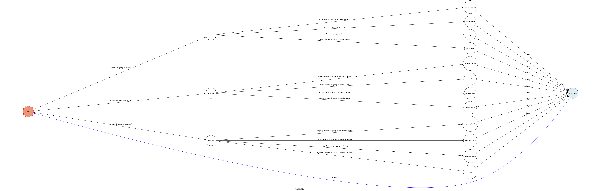

# TOC Final Project 2017

A telegram bot based on a finite state machine, which give you the most popular video on youtube

## Setup

### Prerequisite
* Python 3

#### Install Dependency
```sh
$ pip3 install -r requirements.txt
```

* pygraphviz (For visualizing Finite State Machine)
    * [Setup pygraphviz on Ubuntu](http://www.jianshu.com/p/a3da7ecc5303)

### Secret Data

`API_TOKEN` and `WEBHOOK_URL` in app.py **MUST** be set to proper values.
Otherwise, you might not be able to run your code.

### Run Locally
You can either setup https server or using `ngrok` as a proxy.

**`ngrok` would be used in the following instruction**

```sh
$ ngrok http 5000
```

After that, `ngrok` would generate a https URL.

You should set `WEBHOOK_URL` (in app.py) to `your-https-URL/hook`.

#### Run the sever

```sh
$ python3 app.py
```

## Finite State Machine


## Usage
1. Type Anything to bot
    * Bot will reply you to choose a region
2. Choose a region
    * Bot will reply you to choose a channel
3. Choose a channel you prefer to watch
    * Bot will list the top5 popular video
* If you type something invalid, Bot will not give you any respone

## NOTE
The initial state is set to `user`.
